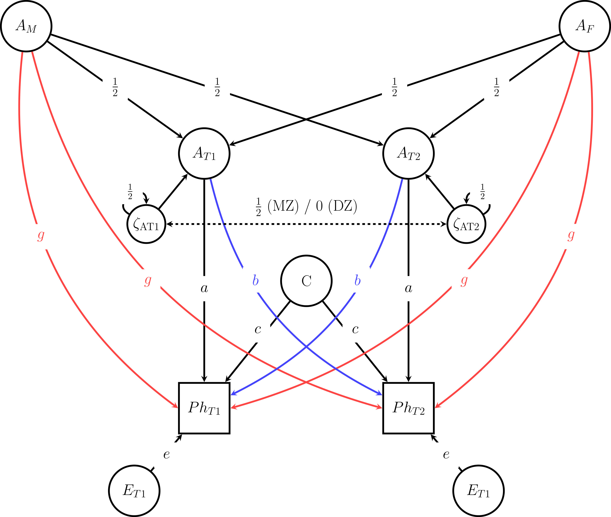

# gnomesims

<p align = "center">
  
</p>

## Overview

`gnomesims` (pronounced 'genome sims') is an R package to perform genomic simulations on models of gene-environment correlation. It contains wrapper functions for `OpenMx` and GEE models and example data which allow researchers to perform power analyses for studies using family-based designs that incorporate polygenic scores. It accompanies our paper 'A simulation study on detecting cultural transmission and sibling interaction using polygenic scores' which is currently under review. The pre-print is available here: https://www.researchsquare.com/article/rs-5461256/v1.

## Installation

You can install the development version of `gnomesims` from GitHub using:

``` r
# install.packages("devtools")
devtools::install_github("josefinabernardo/gnomesims")
```

## Detailed documentation

For detailed documentation please refer to the vignette: [How to use gnomesims](https://josefinabernardo.github.io/gnomesims/articles/gnomesims.html).

## Abstract

In the classical twin design, the assumption that the additive genetic (A) and shared environment (C) variance components are uncorrelated may not hold. If there is positive AC covariance, the C component is overestimated. While many processes can lead to AC covariance, in this study, we focus on two widely-studied mechanism: Cultural transmission (e.g., genetic nurture), when the parents’ genotype contributes to the effective environment of the child, and sibling interaction, when the genotype of one sibling contributes to the effective environment of another. Several designs use polygenic scores of parents or siblings to detect AC covariance, but these models cannot unambiguously identify the source. A combined model has been proposed, but its power to identify both processes has not been well-studied yet. This study uses simulated data from genotyped twins and their parents to investigate the power to disentangle these processes. Results demonstrated that we can detect AC covariance using either genotyped-sibling or genotyped-parent data, but we cannot resolve its source and risk making wrong inferences. However, these sources of AC covariance can be resolved using genotyped data of both siblings and parents. We implement these findings in an R package for genomic simulations, *gnomesims*, and emphasize the need for whole-family genotyping and modeling.

*Keywords:* AC covariance, classical twin design, gene-environment interplay, polygenic scores, statistical power

## The Model

<p align = "center">
  
</p>


**Path Diagram of the Data-generating Model.** This figure shows the path diagram that serves as the basis for the exact data simulation. In the model which is later applied to the data the additive genetic components are estimated using PGSs, which only account for a proportion of A. A~M~ – additive genetic component mother, A~F~ – additive genetic component father, A~T1~ – additive genetic component twin 1, A~T2~ – additive genetic component twin 2,  ζ~AT1~ – Mendelian segregation variance A~T1~, ζ~AT2~ – Mendelian segregation variance A~T2~, C – shared environment component, Ph~T1~ – phenotype twin 1, Ph~T2~ – phenotype twin 2, E~T1~ – unshared environment component twin 1, E~T2~ – unshared environment component twin 2, a – path coefficient additive genetic component, c – path coefficient shared environment component, e – path coefficient unique environment component, g – path coefficient cultural transmission, b – path coefficient sibling interaction. The label on the dashed arrow between the Mendelian segregation variances denotes the MZ and DZ covariances.
