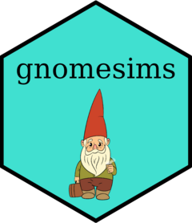

# gnomesims

<table>
<tr>
<td>
  
## Overview

`gnomesims` is an R package for the simulation of gene-environment correlation.

## Installation

You can install the development version of `gnomesims` from GitHub with:

```r
# install.packages("devtools")
devtools::install_github("josefinabernardo/gnomesims")
```

## Detailed documentation

For detailed documentation please refer to the vignette: [How to use gnomesims]([docs/articles/gnomesims.html](https://josefinabernardo.github.io/gnomesims/articles/gnomesims.html)).

</td>
<td>



</td>
</tr>
</table>

